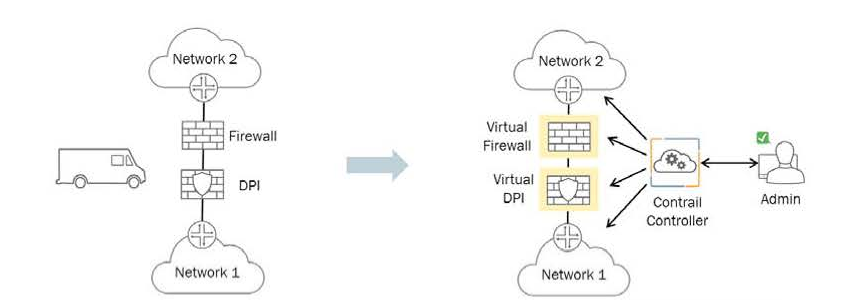
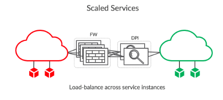

## Đề tài: Auto Scale thông qua giám sát tập trung trong hệ thống Contrail Cloud kết hợp OpenStack

### Đặt vấn đề

- Với các hệ thống Cloud thực tế, việc giám sát rất quan trọng. Mỗi khi hệ thống gặp lỗi, quản trị viên cần được nhận được thông báo qua mail, tin nhắn, .. cũng như cần phải có hệ thống log tập trung để việc trace lỗi, khắc phục hệ thống được dễ dàng.
- Từ việc giám sát trên, trong môi trường production khi tải của các service thay đổi liên tục, việc tự động scale khi service cao tải là vô cùng thiết yếu.
- Với hệ thống Cloud OpenStack cũ, việc sử dụng Telemetry, Ceilometer, Gnocchi, Aodh để monitor cũng như autoscale VM khi cao tải hiện tại có nhiều hạn chế:
  + Ceilometer, Aodh nhận được ít sự đóng góp từ cộng đồng. Ceilometer API đã bị deprecated.
  + Các thông số giám sát rất hạn chế chỉ gồm các thông số như CPU, RAM
  + Aodh có công thức riêng xác định rule dựa trên Ceilometer metrics (lưu trong Gnocchi) nhưng nó không đúng nên đôi khi gây ra hành động scale sai

- Với việc triển khai hệ thống SDN Controller Tungsten Fabric, việc kết nối giữa các mạng thông qua chuỗi các service instance gọi là service chaining. Các service instance có thể là firewall, load balancer. Việc auto scale service chain sẽ giúp network trở nên flexible.

#### Service Chaining

- Trong mạng truyền thống, thông thường network services( như L4-7 firewalls, network address translation-NAT, intrusion protection, load balancers ) được tạo bằng cách chained các thiết bị vật lý thông qua cáp. Truyền thống, các network services được cố định trong các thiết bị điều này gây ra việc inflexible, khó khăn trong việc scale và làm phức tạp mạng.
- Với việc ra đời mạng SDN, việc sử dụng Dynamic service chaining dẫn đến trích xuất các network service từ network và security device, chạy chúng trên các VM và tự động liên kết với nhau tạo logical flow. Lợi ích của dynamic service chaining virtual service có thể áp dụng trong nhiều cách thức. Người quản trị mạng sử dụng những service này để thay thế network function trên các thiết bị vật lý, cải thiện hiệu quả và vận hành internal network. 

- Trong hệ thống Tungsten Fabric kết hợp OpenStack, mỗi VM tạo thành service chaining được gọi là service instance. Khi một service instance không đủ khả năng để xử lý traffic yêu cầu của một service chain, nhiều VM cùng kiểu có thể được bao gồm trong một service như hình. Khi một VM cao tải: network, cpu, ram, ... ta có thể tạo thêm VM để thực hiện việc load balancer.

### Monitor

- Sử dụng prometheus để monitor các thông số thông qua các exporter có sẵn hoặc tự build: node exporter, cadvisor, virtual-machine, virtual-network
- Sử dụng grafana vẽ giao diện dựa theo các thông số monitor được
- Sử dụng alert-mangager và mail proxy để nhận cảnh báo và gửi cho người quản trị
- Giám sát các thiết bị vật lý bằng cách enable SNMP, LLDP trên chúng

### Auto Scale

- Sử dụng prometheus monitor giám sát các thiết bị và alertmanager để gửi cảnh báo
- Sử dụng project faythe để nhận cảnh báo từ alert manager sau đó thực hiện trigger đến heat
- Sử dụng heat để gọi đến nova api scale VM

