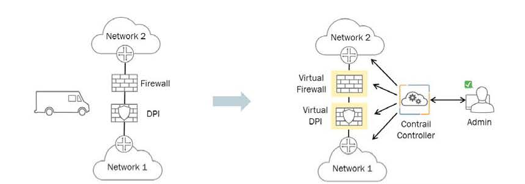
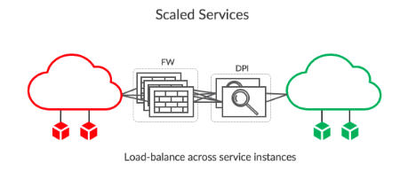

## Đề tài: Autoscaling using Prometheus, Faythe, Heat in Contrail Cloud Integration with OpenStack System

## Hiện trạng

- Với hệ thống Cloud thực tế, việc giám sát rất quan trọng. Mỗi khi hệ thống gặp lỗi, quản trị viên cần được nhận được thông báo qua mail, tin nhắn, .. qua đó kịp thời phát hiện sự cố và giải quyết. Ngoài việc khắc phục lỗi mỗi khi nhận được cảnh báo với những service đặc thù trong môi trường production, khi các dịch vụ cao tải hệ thống cần phải tự nhận dạng sau đó tự động scale tài nguyên để dịch vụ không bị ảnh hưởng.
- Với hệ thống Cloud OpenStack cũ, hiện tại việc sử dụng Telemetry, Ceilometer, Gnocchi, Aodh để monitor cũng như autoscale VM khi cao tải  có nhiều hạn chế:
  + Ceilometer, Aodh nhận được ít sự đóng góp từ cộng đồng. Ceilometer API đã bị deprecated.
  + Các thông số giám sát rất hạn chế chỉ gồm các thông số như CPU, RAM
  + Aodh có công thức riêng xác định rule dựa trên Ceilometer metrics (lưu trong Gnocchi) nhưng nó không đúng nên đôi khi gây ra hành động scale sai

- Bên cạnh đó với việc ra đời mạng SDN, với những vấn đề còn tồn đọng của Neutron OpenStack việc triển khai tích hợp một SDN Controller khác thay thế cho Neutron là nhu cầu thiết yếu. Trong SDN Controller, một trong những key feature của SDN Controller Contrail đó là service chaining với các virtual network function.

#### Service Chaining

- Trong mạng truyền thống, thông thường network services( như L4-7 firewalls, network address translation-NAT, intrusion protection, load balancers ) được tạo bằng cách đấu nối các thiết bị vật lý thông qua cáp. Truyền thống, các network services được cố định trong các thiết bị điều này gây ra việc inflexible, khó khăn trong việc scale và làm phức tạp mạng.
- Với việc ra đời mạng SDN, việc sử dụng Dynamic service chaining trích xuất các network service từ network và security device chạy chúng trên các VM và tự động liên kết với nhau tạo logical flow. Lợi ích của dynamic service chaining virtual service có thể áp dụng trong nhiều cách thức. Người quản trị mạng sử dụng những service này để thay thế network function trên các thiết bị vật lý, cải thiện hiệu quả mạng và vận hành mạng.



- Trong kiến trúc Open Contrail, một tập hợp các VM tạo thành service instance, chuỗi các instance được gọi là service chain. Khi một service instance không đủ khả năng để xử lý traffic yêu cầu của một service chain, nhiều VM cùng kiểu có thể được bao gồm trong một service như hình. Khi một VM cao tải: network, cpu, ram, ... ta cần tạo thêm VM để thực hiện việc load balancer.



## Giải pháp 

- Sử dụng Prometheus server, prometheus alertmanager, prometheus exporter thay cho Telemetry để thực hiện monitor và scale với nhiều thông số hơn.

```

                                               +--------------------------------------------------+
                                               |                                                  |
                                               |     +-----------------+  +-----------------+     |
+---------------------+                        |     |   Instance 1    |  |   Instance 2    |     |
|                     |                        |     |                 |  |                 |     |
|                     |            Scrape Metrics    |  +-----------+  |  |  +-----------+  |     |
|  Prometheus server  <------------------------+--------+Exporter(s)|  |  |  |Exporter(s)|  |     |
|                     |                        |     |  +-----------+  |  |  +-----------+  |     |
|                     |                        |     +-----------------+  +-----------------+     |
+----------+----------+                        |     +--------------------------------------+     |
           |                                   |     |           Autoscaling Group          |     |
           | Fire alerts                       |     +--------------------------------------+     |
           |                                   |                                                  |
           |                                   |                                                  |
+----------v------------+                      |     +--------------------------------------+     |
|                       |         Send scale request |                                      |     |
|Prometheus Alertmanager+----------------------+----->          Scaling Policy              |     |
|                       |                      |     |                                      |     |
+-----------------------+                      |     +--------------------------------------+     |
                                               |                                                  |
                                               |                     Heat Stack                   |
                                               +--------------------------------------------------+

```

- Cài đặt, running exporter trên các thực thể cần giám sát.

- Prometheus server scrape metric từ các exporter chạy trong các instance (VM, service instance).

- Prometheus server đánh giá metric dựa trên các rule đã định sẵn.

- Prometheus server gửi alert tới Prometheus alertmanager.

- Prometheus alertmanager gửi POST scale request tới Heat Scaling policy với webhook configuration.

- Heat tạo ra các template và thực hiện scalce instance (VM, service instance).

#### Visualize

- Sử dụng grafana vẽ giao diện dựa theo các thông số monitor được.

#### Future Works

- Monitor thiết bị vật lý, visualize topology, capture flow: enable SNMP, LLDP, sFlow

