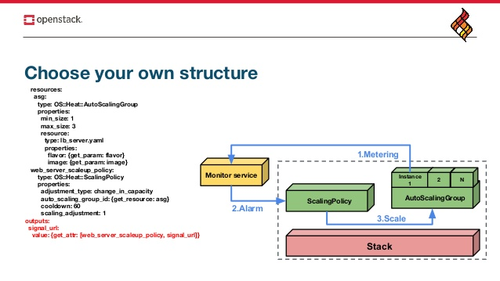

## Đề tài: Autoscaling using Prometheus, Faythe, Heat in Contrail Cloud Integration with OpenStack System

## Hiện trạng

- Với hệ thống Cloud thực tế, việc giám sát rất quan trọng. Mỗi khi hệ thống gặp lỗi, quản trị viên cần được nhận được thông báo qua mail, tin nhắn, .. qua đó kịp thời phát hiện sự cố và giải quyết. Ngoài việc khắc phục lỗi mỗi khi nhận được cảnh báo với những service đặc thù trong môi trường production, khi các dịch vụ cao tải hệ thống cần phải tự nhận dạng sau đó tự động scale tài nguyên để dịch vụ không bị ảnh hưởng.
- Với hệ thống Cloud OpenStack cũ, hiện tại việc sử dụng Telemetry, Ceilometer, Gnocchi, Aodh để monitor cũng như autoscale VM khi cao tải  có nhiều hạn chế:
  + Ceilometer, Aodh nhận được ít sự đóng góp từ cộng đồng. Ceilometer API đã bị deprecated.
  + Các thông số giám sát rất hạn chế chỉ gồm các thông số như CPU, RAM
  + Aodh có công thức riêng xác định rule dựa trên Ceilometer metrics (lưu trong Gnocchi) nhưng nó không đúng nên đôi khi gây ra hành động scale sai

- Bên cạnh đó với việc ra đời mạng SDN, với những vấn đề còn tồn đọng của Neutron OpenStack việc triển khai tích hợp một SDN Controller khác thay thế cho Neutron là nhu cầu thiết yếu. Trong SDN Controller, một trong những key feature của SDN Controller Contrail đó là service chaining với các virtual network function.

#### Service Chaining

- Trong mạng truyền thống, thông thường network services( như L4-7 firewalls, network address translation-NAT, intrusion protection, load balancers ) được tạo bằng cách đấu nối các thiết bị vật lý thông qua cáp. Truyền thống, các network services được cố định trong các thiết bị điều này gây ra việc inflexible, khó khăn trong việc scale và làm phức tạp mạng.
- Với việc ra đời mạng SDN, việc sử dụng Dynamic service chaining trích xuất các network service từ network và security device chạy chúng trên các VM và tự động liên kết với nhau tạo logical flow. Lợi ích của dynamic service chaining virtual service có thể áp dụng trong nhiều cách thức. Người quản trị mạng sử dụng những service này để thay thế network function trên các thiết bị vật lý, cải thiện hiệu quả mạng và vận hành mạng.


- Trong kiến trúc Open Contrail, một tập hợp các VM tạo thành service instance, chuỗi các instance được gọi là service chain. Khi một service instance không đủ khả năng để xử lý traffic yêu cầu của một service chain, nhiều VM cùng kiểu có thể được bao gồm trong một service như hình. Khi một VM cao tải: network, cpu, ram, ... ta cần tạo thêm VM để thực hiện việc load balancer.


## Xây dựng hệ thống 

- Monitor: sử dụng công cụ monitor mã nguồn mở khác cho phép monitor được nhiều thông số từ các instances
- Scaling: sử dụng Heat- OpenStack Orchestration 
( Sử dụng Prometheus server, prometheus alertmanager, prometheus exporter thay cho Telemetry để thực hiện monitor và scale với nhiều thông số hơn )

```

                                               +--------------------------------------------------+
                                               |                                                  |
                                               |     +-----------------+  +-----------------+     |
+---------------------+                        |     |   Instance 1    |  |   Instance 2    |     |
|                     |                        |     |                 |  |                 |     |
|                     |            Scrape Metrics    |  +-----------+  |  |  +-----------+  |     |
|  Prometheus server  <------------------------+--------+Exporter(s)|  |  |  |Exporter(s)|  |     |
|                     |                        |     |  +-----------+  |  |  +-----------+  |     |
|                     |                        |     +-----------------+  +-----------------+     |
+----------+----------+                        |     +--------------------------------------+     |
           |                                   |     |           Autoscaling Group          |     |
           | Fire alerts                       |     +--------------------------------------+     |
           |                                   |                                                  |
           |                                   |                                                  |
+----------v------------+                      |     +--------------------------------------+     |
|                       |         Send scale request |                                      |     |
|Prometheus Alertmanager+----------------------+----->          Scaling Policy              |     |
|                       |                      |     |                                      |     |
+-----------------------+                      |     +--------------------------------------+     |
                                               |                                                  |
                                               |                     Heat Stack                   |
                                               +--------------------------------------------------+

```

### Chức năng của hệ thống

- Monitor network mức overlay
  - virtual network
  - virtual machine
  - virtual interface
  - service instances
- Visualize các thông tin thu thập được qua giao diện
- Alerting
  - gửi cảnh báo khi hệ thống có lỗi dựa theo các rule do người quản trị đặt ra
  - gửi mail resolved khi hệ thống đã khắc phục được lỗi
- Autoscaling 
  - tự động scale instance (VM, service instance) theo các file rule được đặt ra dựa vào thông số đã monitor được

### Giải pháp

#### Monitor

- Hiện nay có nhiều công cụ hỗ trợ monitor như: Zabbix, Datadog, Prometheus,.. Em chọn prometheus vì những ưu điểm sau:
  - prometheus là phần mềm mã nguồn mở, có cộng đồng đủ lớn
  - prometheus được nhiều công ty tại Việt Nam sử dụng

Hiện tại Prometheus đã hỗ trợ một số exporter cho OpenStack chưa hỗ trợ Tungsten Fabric
--> Cần implement các exporter để lấy metric từ các object của Tungsten Fabric: vrouter, virtual network, virtual machine interface, service instance

#### Visualize

- Sử dụng grafana để vẽ đồ thị, bảng,.. từ các metric đã lấy được từ prometheus thông qua ngôn ngữ PromQL

#### Alerting

- Prometheus có hỗ trợ alertmanager cho việc gửi cảnh báo tới quản trị dựa theo các file alert rule được định nghĩa. Cảnh báo sẽ được gửi tới một mailproxy. 
- Lựa chọn mailproxy
  + build mailproxy qua docker
  + sử dụng mailproxy của Google
  + sử dụng mailproxy của Viettel

#### AutoScaling

- Kiến trúc tổng quan các thành phần để thực hiện việc autoscale



Autoscaling gồm 3 bước:
- Metering
- Alarm
- Scale

OpenStack Telemetry ứng dụng trong việc Metering và Alarm nhưng hiện tại gặp nhiều vấn đề. Đề tài của em sử dụng một cách tiếp cận mới khi thay thế OpenStack Telemetry bởi Prometheus stack, cùng việc sử dụng Faythe và Orchestration Heat.
- Mặc định, Alertmanager webhook config không hỗ trợ HTTP headers, trong khi đó Heat Scaling Policy signal url yêu cầu X-Auth-Token trong header, dẫn đến alertmanager không thể giao tiếp trực tiếp với Heat Scaling Policy. Việc implement project Faythe cho phép nhận alert từ Alertmanager webhook. Khi nhận được alert, Faythe sẽ gửi trigger scale request tới Heat Scaling Policy. Sau đó Heat sẽ sử dụng các template đã khai báo để scale instance theo yêu cầu.

#### Future Works

- Monitor thiết bị vật lý, visualize topology, capture flow: enable SNMP, LLDP, sFlow

